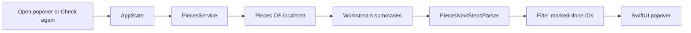

# missingpieces

**A calm macOS menu bar companion for Pieces OS.**

missingpieces shows the next steps that Pieces OS already noticed in recent workstream summaries. Open the menu bar popover, scan what you may have missed, copy what matters, and mark the rest done locally.

[Download DMG](https://github.com/dot-RealityTest/missingpieces/releases/latest/download/missingpieces-1.0.0-b2.dmg) | [Landing Page](https://dot-realitytest.github.io/missingpieces/) | [Latest Release](https://github.com/dot-RealityTest/missingpieces/releases/latest) | [Release Notes](release/RELEASE_NOTES.md) | [Pieces OS](https://pieces.app/)

## Why It Exists

Pieces OS can remember the shape of your work: files, snippets, sessions, summaries, and loose follow-ups. missingpieces gives that memory a small practical surface.

It does not try to become another task manager. It simply asks:

> What did Pieces already notice that I might be forgetting?

## Highlights

- **Menu bar first:** no Dock icon, no dashboard to manage
- **Read-only Pieces integration:** reads workstream summaries, never writes back
- **Next-step extraction:** parses `Next Steps` bullets from recent Pieces summaries
- **Grouped by work session:** keeps follow-ups tied to the context they came from
- **Local triage:** expand, copy, mark done, and restore marked-done items
- **Quiet refresh model:** refresh on popover open if enabled, or when you click **Check again**
- **Signed release:** Developer ID signed, notarized, and stapled

## Requirements

- macOS 14 or later
- Pieces OS running locally
- Local access to Pieces OS on `localhost`

missingpieces usually connects to Pieces OS on port `39300`, with a fallback to `1000`.

## Install

1. Download [missingpieces-1.0.0-b2.dmg](https://github.com/dot-RealityTest/missingpieces/releases/latest/download/missingpieces-1.0.0-b2.dmg).
2. Open the DMG.
3. Drag `missingpieces.app` to Applications.
4. Launch `missingpieces` from Applications.
5. Keep Pieces OS running.

The public DMG is Developer ID signed, notarized, and stapled.

## How It Works

missingpieces is intentionally small:

1. Check whether Pieces OS is reachable on localhost.
2. Fetch recent `WORKSTREAM_SUMMARIES`.
3. Load each summary's `SUMMARY` annotation.
4. Parse the `Next Steps` section.
5. Show compact rows grouped by work session.
6. Hide locally marked-done rows.

Nothing is pushed back into Pieces.

## Product Behavior

| Action | Result |
|--------|--------|
| Open popover | Shows the current list and optionally refreshes |
| Click **Check again** | Fetches recent summaries from Pieces OS |
| Click a row | Expands or collapses the full text |
| Double-click a row | Copies the step text |
| Right-click a row | Shows **Mark done** and **Copy** |
| Mark done | Hides that item locally |
| Restore in Settings | Brings locally marked-done items back |

## Privacy Model

missingpieces is local-first and narrow by design.

It does:

- Connect to Pieces OS on your Mac
- Store settings in `UserDefaults`
- Store marked-done item IDs locally
- Cache the last known Pieces OS port locally

It does not:

- Upload your data to a separate server
- Create, edit, or delete data in Pieces OS
- Maintain a separate cloud task list
- Poll Pieces OS in the background

## Build From Source

Clone the repository:

```bash
git clone https://github.com/dot-RealityTest/missingpieces.git
cd missingpieces
```

Build and run a local debug app:

```bash
python3 generate_xcode.py
xcodebuild -project PiecesTask.xcodeproj -target missingpieces -configuration Debug build
open build/Debug/missingpieces.app
```

Open in Xcode:

```bash
open PiecesTask.xcodeproj
```

After adding or removing Swift files under `PiecesTask/`, regenerate the Xcode project:

```bash
python3 generate_xcode.py
```

## Release Build

The release script builds a Developer ID signed app and creates a DMG:

```bash
./scripts/release.sh
```

Release signing requires:

- A Developer ID Application certificate
- Apple Developer Team ID `P5RB3W3D58`
- Notarization credentials outside the repository

The script does not store Apple credentials.

## Project Structure

| Path | Purpose |
|------|---------|
| `PiecesTask/` | Swift source |
| `PiecesTask.xcodeproj/` | Generated Xcode project |
| `PiecesTaskAssets.xcassets/` | App icon and menu bar icon assets |
| `landing/` | GitHub Pages landing page |
| `docs/` | Product, design, and pipeline notes |
| `release/` | Install notes and release notes |
| `scripts/release.sh` | Release build and DMG script |
| `generate_xcode.py` | Xcode project generator |

## Architecture Notes

Core flow:



Key implementation pieces:

- `PiecesService`: localhost health checks and Pieces OS API calls
- `PiecesNextStepsParser`: extracts readable follow-up rows
- `AppState`: refresh flow, grouping, filtering, and copy state
- `AppSettings`: preferences and local marked-done storage
- `RootPopoverView`: main menu bar popover
- `SettingsView`: compact auto-saving settings window

More detail lives in [docs/FEATURES_AND_PIPELINE.md](docs/FEATURES_AND_PIPELINE.md).

## Roadmap

The current `main` branch is intentionally lean.

Possible future work:

- Cleaner first-run empty states
- More resilient parsing for unusual summary formats
- Optional launch-at-login support
- Better release automation
- A small diagnostics view for Pieces OS connection state

Out of scope for the current product:

- Writing tasks back to Pieces
- Cloud sync
- Background polling
- A separate task database

## Repository Status

This repository is public for visibility, distribution, and review. The app is small, focused, and currently maintained as a personal Pieces OS companion.

## License

Source available. All rights reserved unless a separate license is added.

See [LICENSE](LICENSE).

## Acknowledgements

missingpieces is an independent companion app for people already using Pieces OS.
Pieces and Pieces OS belong to their respective owners.
