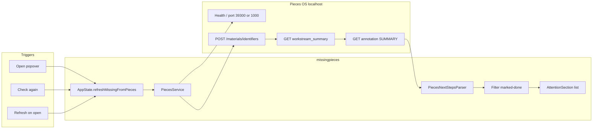

# missingpieces — Features & Pipeline

Plain reference for what the **lean `main`** build does and how data moves through the app.

> Repo folder is still `PiecesTask/`; the shipped app name is **missingpieces**.

## Product scope

**missingpieces** is a **macOS menu bar utility** (no Dock icon) that shows **next steps** pulled from recent **Pieces OS** workstream summaries. It is **read-only** toward Pieces: nothing is written back to Pieces, and there is no separate in-app task database.

| In scope (`main`) | Out of scope (see `lean-core` branch) |
|-------------------|--------------------------------------|
| Fetch recent workstream summaries | Ollama / AI summary in popover |
| Parse `### **Next Steps**` bullets | Global shortcut ⌃⌥P |
| Group by work session | Undo banner, snooze, save-for-later queues |
| Local **Mark done** (hide) | Launch at login, push notifications |
| Copy / expand row interactions | Multi-tab Settings, connectivity test UI |

**Version:** 1.0.0 (build 2) · **Bundle ID:** `app.missingpieces` · **Minimum macOS:** 14.0

---

## User-facing features

### Menu bar

- Custom **puzzle-piece** icon (`MenuBarIcon` asset) with a status dot:
  - **Green** — Pieces OS connected
  - **Blue** — connected and follow-ups visible
  - **Gray** — offline / Pieces not running
  - **Orange** — problem state in list
- **Right-click** menu via AppKit (`MenuBarRightClickMenu`) — SwiftUI `.contextMenu` does not work with `MenuBarExtra` `.window` style.

### Popover (“What you're missing”)

- **Check again** — manual refresh from Pieces
- **Settings** — preferences window
- Optional **refresh on open** (toggle in Settings)
- List grouped by **work session** (`AttentionSection`)
- **Empty state:** “You're caught up”
- **Offline state:** single row when Pieces OS is not running
- Footer hints for tap / mark-done behavior

### Row interactions

| Gesture | Action |
|---------|--------|
| Single click | Expand / collapse full step text |
| Double click | Copy step text to clipboard |
| Right click | **Mark done** or **Copy** |

Marked-done IDs persist locally (`UserDefaults` via `AppSettings`).

### Settings (~480×400)

Single scroll sheet (auto-saves):

- Refresh when popover opens
- Lookback window (days)
- **Show up to** cap (visible rows)
- Manual refresh
- Marked-done count + **restore all**
- Connection status in header subtitle (no “Open Pieces OS” button in popover)

---

## Data pipeline

End-to-end flow from Pieces OS to the popover list.



### Step-by-step

1. **Connectivity** — `PiecesService` resolves base URL: cached port, then parallel health on **39300** and **1000**. Application ID: `app.missingpieces`.
2. **List summaries** — `POST /materials/identifiers` with type `WORKSTREAM_SUMMARIES` and lookback date from Settings.
3. **Per summary** — `GET /workstream_summary/{id}` → newest annotation IDs → `GET /annotation/{id}` for `SUMMARY` markdown.
4. **Parse** — `PiecesNextStepsParser` finds `### **Next Steps**` and bullet lines; builds `displayTitle` / `displaySubtitle` for scanning.
5. **Cap** — Limits per summary, per session dedupe, and global max from Settings (`maxSummaries`, `maxStepsPerSummary`, `maxTotal`).
6. **Local filter** — Drop rows whose `FollowUpItemID` (SHA256 of summary ID + normalized text) is in dismissed set.
7. **UI** — `RootPopoverView` renders sections; `MissingRowView` handles expand/copy/done.

### Refresh policy

- **No background polling** — only on user open (if enabled) or **Check again**.
- In-flight refresh is cancellable when popover closes or a new refresh starts.

---

## Build & release pipeline

### Day-to-day development

```bash
# After adding Swift files under PiecesTask/
python3 generate_xcode.py

xcodebuild -project PiecesTask.xcodeproj -target missingpieces -configuration Debug build
```

### Release (signed app + DMG)

```bash
./scripts/release.sh
```

| Output | Path |
|--------|------|
| Release app | `build/Release/missingpieces.app` |
| DMG | `release/missingpieces-1.0.0-b2.dmg` |

Release build uses **Developer ID** signing, **hardened runtime**, and `PiecesTask/missingpieces.entitlements`. The release DMG is signed, notarized, and stapled.

### Regenerate Xcode project

`generate_xcode.py` walks `PiecesTask/**/*.swift` and rewrites `project.pbxproj`. Release signing settings are embedded for the Release configuration only.

---

## Source layout (19 Swift files)

| Area | Files |
|------|--------|
| Entry | `MissingPiecesApp.swift`, `AppDelegate.swift` |
| State | `AppState.swift`, `AppSettings.swift` |
| Pieces | `PiecesService.swift`, `PiecesNextStepsParser.swift` |
| Models | `AttentionItem.swift`, `FollowUpItemID.swift` |
| UI | `RootPopoverView.swift`, `SettingsView.swift`, `MissingRowView.swift` |
| Chrome | `PopoverGlassBackground.swift`, `PopoverMotion.swift`, `PiecesUI.swift`, `MenuBarStatusIcon.swift`, `MenuBarStatusLabel.swift` |
| AppKit bridge | `MenuBarRightClickMenu.swift`, `MenuBarStatusItemFinder.swift`, `SettingsWindowPresenter.swift` |

---

## Branches

| Branch | Role |
|--------|------|
| **`main`** | Lean product — ship from here |
| **`lean-core`** | Older fuller build (reference only) |

---

## Related docs

- [DESIGN.md](./DESIGN.md) — visual system and motion
- [../AGENTS.md](../AGENTS.md) — agent preferences and workspace facts
- [../release/RELEASE_NOTES.md](../release/RELEASE_NOTES.md) — install and notarization
